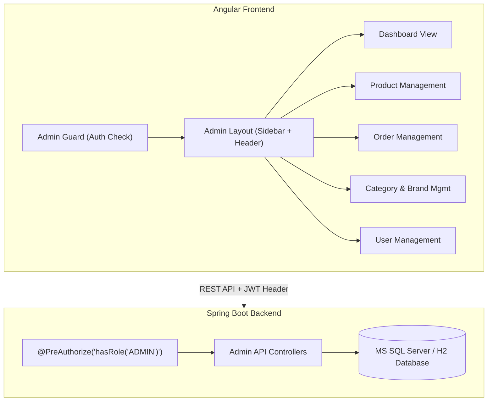

# Lộ Trình Phát Triển Trang Admin (TechZone Admin Dashboard)

Tài liệu này phác thảo chi tiết các giai đoạn và từng bước thực hiện để xây dựng hệ thống **Admin Dashboard** hoàn chỉnh cho dự án **TechZone E-Commerce**, đảm bảo chuẩn kiến trúc Spring Boot (Backend) + Angular 18 (Frontend).

---

## 🏗️ 1. Tổng Quan Kiến Trúc Admin Dashboard



---

## 🚀 2. Các Giai Đoạn Thực Hiện (Phases)

### 📌 Giai Đoạn 1: Bổ Sung Admin APIs & Phân Quyền Backend (Hoàn thành ✅)

Trước khi dựng giao diện Admin ở Frontend, Backend cần cung cấp đầy đủ các API quản trị kèm bảo mật JWT `ROLE_ADMIN`.

#### Tasks:
1. **Kiểm tra Security Config (`SecurityConfig.java`)**:
   - Đảm bảo các route `/api/admin/**` chỉ cho phép token có `ROLE_ADMIN` truy cập (`.hasRole("ADMIN")`).
2. **Xây dựng Dashboard Analytics API (`AdminDashboardController.java`)**:
   - `GET /api/admin/dashboard/stats`: Thống kê tổng doanh thu, tổng đơn hàng, tổng sản phẩm, số khách hàng.
   - `GET /api/admin/dashboard/recent-orders`: 5-10 đơn hàng mới nhất.
   - `GET /api/admin/dashboard/revenue-chart`: Dữ liệu biểu đồ doanh thu theo tháng/ngày.
3. **Bổ sung CRUD APIs Quản Lý Sản Phẩm (`ProductController.java` / `AdminProductController.java`)**:
   - `POST /api/admin/products`: Thêm sản phẩm mới.
   - `PUT /api/admin/products/{id}`: Cập nhật sản phẩm (giá, tồn kho, mô tả, specs, flash sale).
   - `DELETE /api/admin/products/{id}`: Xóa sản phẩm.
4. **Bổ sung Admin API Quản Lý Đơn Hàng (`AdminOrderController.java`)**:
   - `GET /api/admin/orders`: Lấy toàn bộ đơn hàng (phân trang + lọc theo trạng thái).
   - `PUT /api/admin/orders/{id}/status`: Cập nhật trạng thái đơn hàng (`PENDING` ➔ `CONFIRMED` ➔ `SHIPPING` ➔ `DELIVERED` / `CANCELLED`).
5. **Admin API Quản Lý Danh Mục & Thương Hiệu (`AdminCategoryController.java`, `AdminBrandController.java`)**:
   - CRUD danh mục và thương hiệu sản phẩm.

---

### 📌 Giai Đoạn 2: Dựng Layout Admin & Bảo Vệ Route ở Frontend (Hoàn thành ✅)

Tạo khung Layout riêng biệt cho Admin (Sidebar bên trái, Header phía trên) hoàn toàn khác biệt với trang bán hàng của khách.

#### Tasks:
1. **Tạo Admin Guard (`src/app/guards/admin.guard.ts`)**:
   - Kiểm tra `authService.currentUser()` xem người dùng đã đăng nhập và có `role === 'ROLE_ADMIN'` hay không.
   - Nếu không có quyền ➔ Redirect về `/` hoặc thông báo.
2. **Tạo Layout Component (`src/app/layouts/admin-layout/admin-layout.component.ts`)**:
   - **Sidebar**: Logo TechZone Admin, Menu chuyển hướng (Dashboard, Sản phẩm, Đơn hàng, Danh mục, Khách hàng, Về trang chủ).
   - **Header**: Avatar admin, Nút đăng xuất, Thông báo.
   - **Main Content**: `<router-outlet></router-outlet>` để load các trang con.
3. **Cấu Hình Routing (`app.routes.ts`)**:
   ```typescript
   {
     path: 'admin',
     component: AdminLayoutComponent,
     canActivate: [adminGuard],
     children: [
       { path: '', redirectTo: 'dashboard', pathMatch: 'full' },
       { path: 'dashboard', component: AdminDashboardComponent },
       { path: 'products', component: AdminProductListComponent },
       { path: 'products/new', component: AdminProductFormComponent },
       { path: 'products/edit/:id', component: AdminProductFormComponent },
       { path: 'orders', component: AdminOrderListComponent },
       { path: 'categories', component: AdminCategoryListComponent },
       { path: 'users', component: AdminUserListComponent }
     ]
   }
   ```

---

### 📌 Giai Đoạn 3: Phát Triển Trang Tổng Quan Dashboard (Hoàn thành ✅)

Trang hiển thị tổng quan tình hình kinh doanh của TechZone với giao diện hiện đại (Dark Theme / Glassmorphism).

#### UI Elements:
- **4 Thẻ Stat Cards**:
  - 💵 **Tổng doanh thu** (VND)
  - 🛒 **Tổng đơn hàng** (Số lượng đơn)
  - 📦 **Tổng sản phẩm** (Đang kinh doanh)
  - 👤 **Khách hàng mới** (Số lượng đăng ký)
- **Biểu đồ Doanh thu (Chart)**: Biểu đồ cột/đường trực quan.
- **Bảng đơn hàng vừa đặt**: Đơn hàng gần đây kèm trạng thái màu sắc.

---

### 📌 Giai Đoạn 4: Quản Lý Sản Phẩm & Đơn Hàng (Hoàn thành ✅)

#### 1. Quản Lý Sản Phẩm (`/admin/products`):
- **Bảng danh sách (Table)**: Thumbnail, Tên sản phẩm, Danh mục, Giá gốc, Giá khuyến mãi, Tồn kho, Status (Hot/FlashSale).
- **Form Thêm/Sửa Sản Phẩm**: Form nhập thông tin chi tiết, thuộc tính Nổi bật / Flash Sale, thông số kỹ thuật (Specs).

#### 2. Quản Lý Đơn Hàng (`/admin/orders`):
- **Bảng danh sách đơn hàng**: Mã đơn, Tên khách hàng, SĐT, Ngày đặt, Tổng tiền, Trạng thái.
- **Thay đổi trạng thái đơn**: Dropdown cập nhật trạng thái đơn hàng (`Chờ xử lý` ➔ `Đã xác nhận` ➔ `Đang giao hàng` ➔ `Đã hoàn thành` / `Đã hủy`).

---

### 📌 Giai Đoạn 5: Quản Lý Danh Mục, Thương Hiệu & Khách Hàng (Hoàn thành ✅)

#### Tasks:
- **Quản lý Danh mục & Thương hiệu (`/admin/categories`)**: CRUD Category & Brand.
- **Quản lý Khách hàng (`/admin/users`)**: Danh sách người dùng, xem lịch sử mua hàng, khóa/mở khóa tài khoản.
